> [[قبل]{dir="rtl"} [از]{dir="rtl"} [شروع]{dir="rtl"}
> [استفاده،]{dir="rtl"} [لطفا]{dir="rtl"} [نکات]{dir="rtl"}
> [زیر]{dir="rtl"} [را]{dir="rtl"} [به]{dir="rtl"} [خاطر]{dir="rtl"}
> [بسپارید]{dir="rtl"}](#قبل-از-شروع-استفاده-لطفا-نکات-زیر-را-به-خاطر-بسپارید)
> [1]{dir="ltr"}
>
> [[آدرس]{dir="rtl"} [گروه]{dir="rtl"} [و]{dir="rtl"} [کانال]{dir="rtl"}
> [تلگرام]{dir="rtl"}](#آدرس-گروه-و-کانال-تلگرام) [2]{dir="ltr"}

[[طریقه]{dir="rtl"} [نصب]{dir="rtl"}
[اپلیکیشن]{dir="rtl"}](#طریقه-نصب-اپلیکیشن-برای-کاربران)[]{dir="ltr"}
[(برای کاربران) 2]{dir="rtl"}[]{dir="ltr"}

> [[اپل]{dir="rtl"}](#اپل-ios) [- iOS 6]{dir="ltr"}
>
> [[اندروید]{dir="rtl"} []{dir="rtl"}](#اندروید-android)[- Android
> 10]{dir="ltr"}
>
> [[ویندوز]{dir="rtl"} []{dir="rtl"}](#_24aluji1ussa)[- Windows
> 14]{dir="ltr"}
>
> [مک -]{dir="rtl"} [Mac OS]{dir="ltr"} []{dir="rtl"}

[[راه]{dir="rtl"} [اندازی]{dir="rtl"}
[سرور]{dir="rtl"}](#راه-اندازی-سرور-برای-سرویس-دهنگان)[]{dir="ltr"}
[(برای سرویس دهندگان) 15]{dir="rtl"}[]{dir="ltr"}

> [[دریافت]{dir="rtl"} []{dir="rtl"}[VPS]{dir="ltr"}](#دریافت-vps)
> [15]{dir="ltr"}
>
> [[نصب]{dir="rtl"} [نرم]{dir="rtl"} [افزار]{dir="rtl"}
> []{dir="rtl"}[X-UI]{dir="ltr"} [و]{dir="rtl"}
> []{dir="rtl"}[V2RAY]{dir="ltr"}](#نصب-نرم-افزار-x-ui-و-v2ray)
> [17]{dir="ltr"}
>
> [[تنظیمات]{dir="rtl"} [سرور]{dir="rtl"}](#تنظیمات-سرور)
> [18]{dir="ltr"}
>
> [[پنل]{dir="rtl"} [کاربری]{dir="rtl"}](#پنل-کاربری) [19]{dir="ltr"}
>
> [[نصب]{dir="rtl"} []{dir="rtl"}[SSL]{dir="ltr"}](#نصب-ssl)
> [21]{dir="ltr"}
>
> [[دریافت]{dir="rtl"}
> []{dir="rtl"}[certificate]{dir="ltr"}](#دریافت-certificate)
> [21]{dir="ltr"}

[[مراجع]{dir="rtl"}](#مراجع) [**22**]{dir="ltr"}

[]{dir="ltr"}

\
[]{dir="ltr"}

[VPN]{dir="ltr"} [مهسا امینی]{dir="rtl"}

## [قبل از شروع استفاده، لطفا نکات زیر را به خاطر بسپارید]{dir="rtl"}

[]{dir="ltr"}

1.  [برای هر کاربر یک محدودیت ۵ گیگابایتی هفتگی وجود دارد که هر شنبه ۵
    > گیگ بهش اضافه می شود. محدودیت برای این وضع نشده که کسی را محدود
    > کنیم. صرفا برای این وجود داره که اگر یه کاربر به هر دلیلی مصرفش
    > زیاد شد همه ی سرور با صد کاربر پایین نیاید و به مشکل برنخورد (چون
    > هر سرور پهنای باند محدودی داره).]{dir="rtl"}

2.  [در صورت امکان، لطفا، چند نفری از یک کد استفاده نکنید. چون ممکنه
    > مثلا گوشی یه نفر خراب شده باشه یا خیلی زیاد مصرف کنه، بعد این کد
    > مشترک برای همه از کار خواهد افتاد بشه.]{dir="rtl"}

3.  [به دوستان و آشنایانی که نیاز به]{dir="rtl"} [VPN]{dir="ltr"} [دارند
    > بگید جدا جدا بیان به تلگرام. در حال حاضر گروه ۳ تا ادمین داره که
    > ۱۲ ساعت اختلاف زمانی با ایران دارند. ازین جهت هر کسی داخل گروه
    > پیام بده ما می توانیم تضمین کنیم که تا ۱۲ ساعت بعد، براشون کد درست
    > می کنیم.]{dir="rtl"}

4.  [هر سرور ۱۰۰ کاربر را پوشش خواهد داد. کاربرها که به صد نفر برسه سرور
    > جدید درست می کنیم.]{dir="rtl"}

5.  [به نظر می رسه این وی پی ان با اینترنت ایرانسل کار نمی
    > کند.]{dir="rtl"}

[]{dir="ltr"}

## [آدرس گروه و کانال تلگرام]{dir="rtl"}

[]{dir="ltr"}

[دوستانی که دوست ندارند اسمشون رو کسی ببینه میتوند عضو کانال بشن تا
تغییرات رو بتونن دنبال بکنن. دوستانی که میخوان تو بحثها شرکت کنن یا
مشکلات را گزارش بدهند میتونن تو گروه باشند.]{dir="rtl"}

[]{dir="ltr"}

[]{dir="ltr"}

[گروه:]{dir="rtl"}
[[[https://t.me/MahsaAminiVPN]{.underline}](https://t.me/MahsaAminiVPN)]{dir="ltr"}

[کانال:]{dir="rtl"}
[[[https://t.me/MahsaAminiVPN2]{.underline}](https://t.me/MahsaAminiVPN2)]{dir="ltr"}

[آدرس ایمیل:]{dir="rtl"}
[[[mahsa.nika.hadis.sarina@gmail.com]{.underline}](mailto:mahsa.nika.hadis.sarina@gmail.com)]{dir="ltr"}

# [طریقه نصب اپلیکیشن (برای کاربران)]{dir="rtl"}

## [اپل (]{dir="rtl"}[iOS]{dir="ltr"}[)]{dir="rtl"}

[]{dir="ltr"}[۱. اپلیکیشن]{dir="rtl"} [ShadowLink]{dir="ltr"} [را از اپ
استور دانلود کنید
([[لینک]{.underline}](https://apps.apple.com/us/app/shadowlink-shadowsocks-vpn/id1439686518)]{dir="rtl"}[).]{dir="ltr"}

{width="0.49643482064741906in"
height="0.49643482064741906in"}[]{dir="ltr"}

[]{dir="ltr"}[۲. برنامه را اجرا کنید.]{dir="rtl"}

[]{dir="ltr"}[۳. دکمه]{dir="rtl"} [X]{dir="ltr"} [را بزنید. شما برای
استفاده از این سرور ها هیچ هزینه ای لازم نیست پرداخت کنید.]{dir="rtl"}

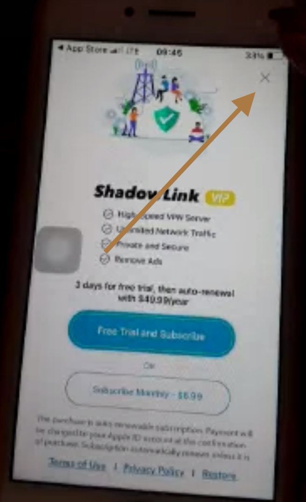{width="2.064932195975503in"
height="3.385528215223097in"}[]{dir="ltr"}

[]{dir="ltr"}

[]{dir="ltr"}[۴. دکمه سرور رو بزنید.]{dir="rtl"}

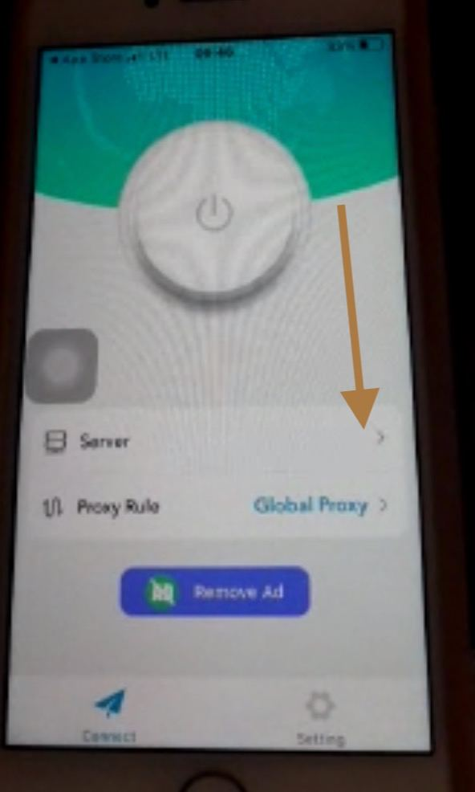{width="2.1001181102362203in"
height="3.494792213473316in"}[]{dir="ltr"}

[]{dir="ltr"}

[]{dir="ltr"}[۵. دکمه +‌ را فشار دهید.]{dir="rtl"}

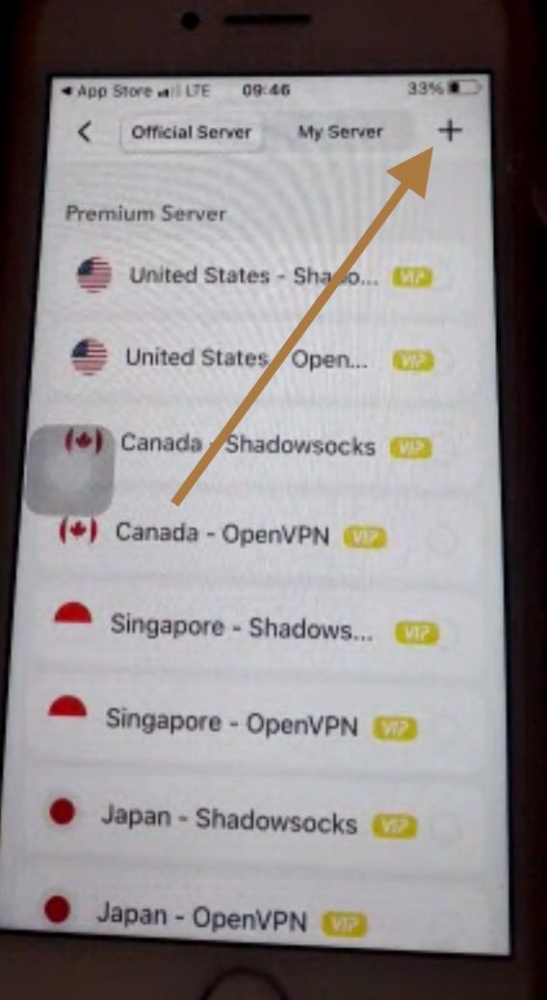{width="2.1873884514435695in"
height="3.9755588363954506in"}[]{dir="ltr"}

[]{dir="ltr"}[۶. بسته به اینکه]{dir="rtl"} [QR]{dir="ltr"} [کد
یا]{dir="rtl"} [URL]{dir="ltr"} [دریافت کرده دکمه]{dir="rtl"} [QR
Code]{dir="ltr"} [یا]{dir="rtl"} [Server links]{dir="ltr"} [را بزنید.
برای این راهنما ما فرض میکنیم که شما]{dir="rtl"} [QR]{dir="ltr"} [کد
دریافت کرده اید.]{dir="rtl"}

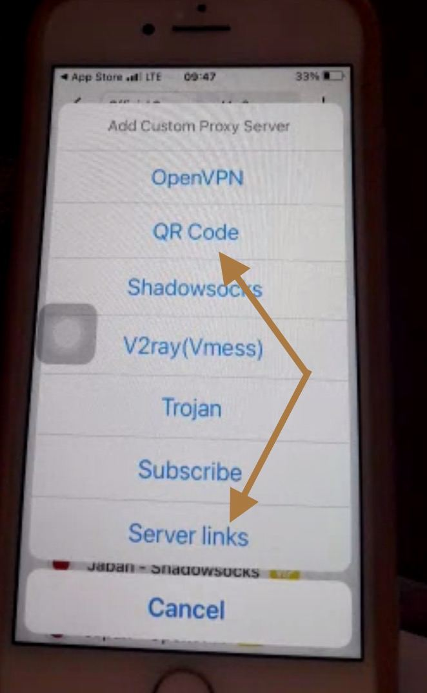{width="2.4468799212598427in"
height="3.9427088801399823in"}[]{dir="ltr"}

[]{dir="ltr"}[۷. در صورتی که دو گوشی در اختیار داریم می
توانید]{dir="rtl"} [QR]{dir="ltr"} [کد را با گوشی دیگر لود کنید ولی ما
چون فقط یک گوشی در اختیار داشتیم]{dir="rtl"} [Album]{dir="ltr"} [را زدیم
تا]{dir="rtl"} [QR code]{dir="ltr"} [که از ادمینها دریافت کرده ایم را
لود کنیم.]{dir="rtl"}

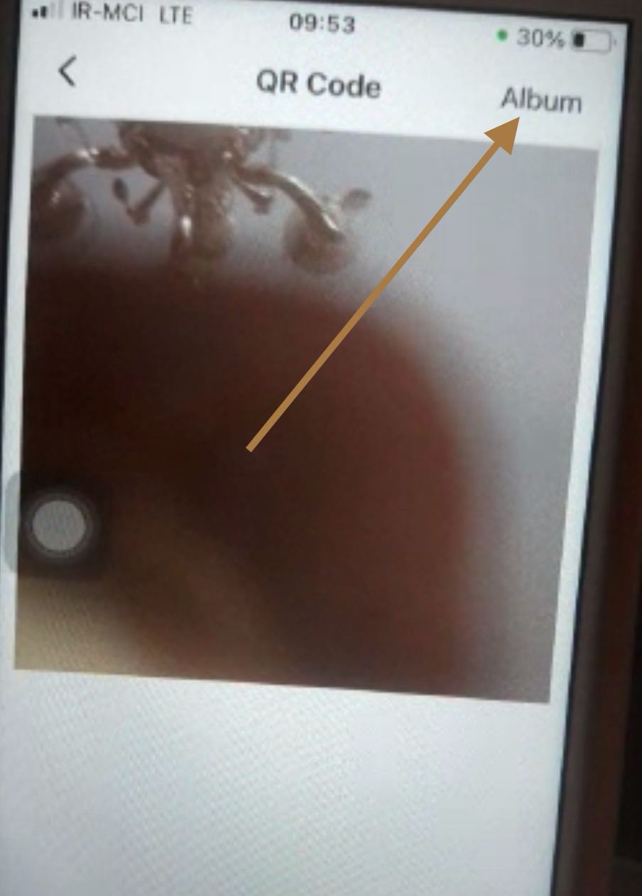{width="2.6278762029746283in"
height="3.622992125984252in"}[]{dir="ltr"}

[]{dir="ltr"}[۸. سرور لود شده باید با کلمه کاربری تلگرام یا آدرس ایمیل
شما یکی باشد. در این صورت آن را انتخاب کنید.]{dir="rtl"}

[]{dir="ltr"}[۹. دکمه خاموش روشن رو بزنید.]{dir="rtl"}

[]{dir="ltr"}[۱۰. در این مرحله برنامه به شما میگوید]{dir="rtl"}
[CONNECTED]{dir="ltr"} [ولی این به معنی اتصال نیست. لطفا چک کنید به
اینترنت متصل هستید]{dir="rtl"}

[]{dir="ltr"}

##  []{dir="ltr"}

## [اندروید (]{dir="rtl"}[Android)]{dir="ltr"}

[]{dir="ltr"}[۱. اپلیکیشن]{dir="rtl"} [XRAY VPN]{dir="ltr"} [را از گوگل
استور دانلود کنید.
([[لینک]{.underline}](https://play.google.com/store/apps/details?id=vpn.v2ray.xray&hl=en_US&gl=US)]{dir="rtl"}[)]{dir="ltr"}

[اگر به گوگل استور دسترسی ندارید، با استفاده از
[[لینک]{.underline}](https://drive.google.com/file/d/1ltwUIYfx8cNA2DRdOjS0mXke93x0Qd9I/view?usp=sharing)]{dir="rtl"}[]{dir="ltr"}
[زیر هم میتونید اپ رو دانلود کنید.]{dir="rtl"}

[]{dir="ltr"}[۲. لطفا به ادمینهای
[[گروه]{.underline}](https://t.me/MahsaAminiVPN)]{dir="rtl"}
[[[تلگرامی]{.underline}]{dir="rtl"}](https://t.me/MahsaAminiVPN)[]{dir="ltr"}
[پیام دهید تا کد]{dir="rtl"} [QR]{dir="ltr"} [را دریافت کنید. بعد از
اینکه پاسخ ایشان را دریافت کردید،]{dir="rtl"} [QR Code]{dir="ltr"} [را
در عکسهای گالری خود ذخیره کنید. یکبار به]{dir="rtl"} [Photos]{dir="ltr"}
[بروید و مطمئن باشید که]{dir="rtl"} [QR]{dir="ltr"} [کد ذخیره شده
است.]{dir="rtl"}

[]{dir="ltr"}[۳. لطفا دکمه + در بالای اپلیکیشن رو فشار دهید]{dir="rtl"}

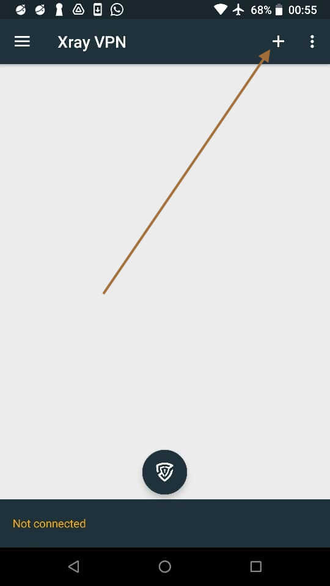{width="2.3928062117235345in"
height="4.230319335083115in"}[]{dir="ltr"}

[در منویی که ظاهر میشود دکمه]{dir="rtl"} [QR]{dir="ltr"} [کد رو
بزنید]{dir="rtl"}

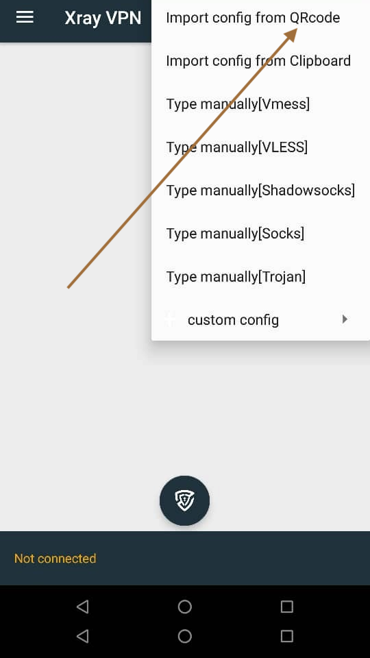{width="2.419942038495188in"
height="4.338542213473316in"}[]{dir="ltr"}

[]{dir="ltr"}

[]{dir="ltr"}

[البته می توانید از]{dir="rtl"} [ServerLink]{dir="ltr"} [هم استفاده کنید
که در آن صورت باید لینک را]{dir="rtl"} [COPY]{dir="ltr"} [کرده باشید. به
تجربه دیده شده است که کاربران با]{dir="rtl"} [QR]{dir="ltr"} [کد راحت تر
بوده اند. در مرحله بعد دکمه]{dir="rtl"} [Album]{dir="ltr"} [که در بالای
اپلیکیشن است فشار دهید تا بتوانید]{dir="rtl"} [QR]{dir="ltr"} [کد را از
گالری انتخاب کنید:]{dir="rtl"}

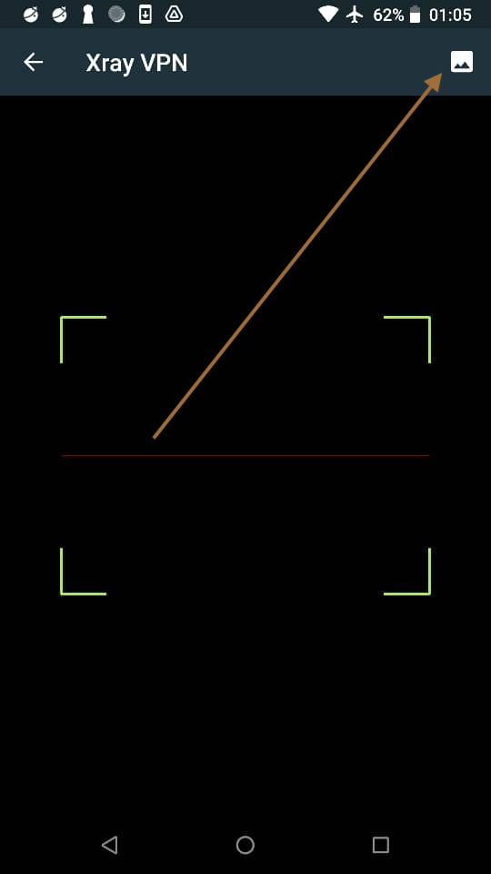{width="2.3994838145231845in"
height="4.247734033245845in"}[]{dir="ltr"}

[]{dir="ltr"}

[دقت کنید که اپلیکیشن از شما اجازه خواهد خواست که به عکسهای شما دسترسی
داشته باشد. دکمه]{dir="rtl"} [Allow]{dir="ltr"} [را در این مرحله
بزنید:]{dir="rtl"}

[]{dir="ltr"}

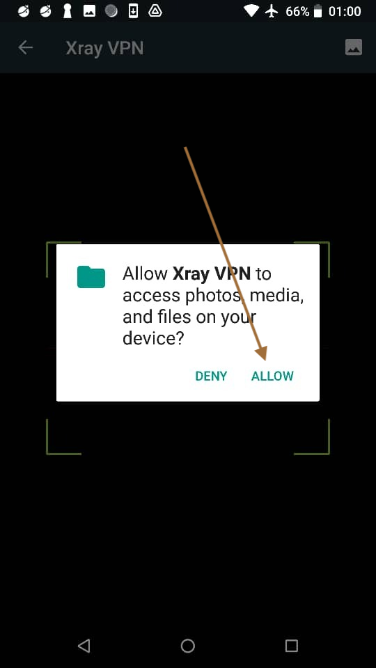{width="2.62249343832021in"
height="4.651042213473316in"}[]{dir="ltr"}

[]{dir="ltr"}

[در این مرحله]{dir="rtl"} [QR]{dir="ltr"} [کد را از گالری انتخاب
کنید.]{dir="rtl"}

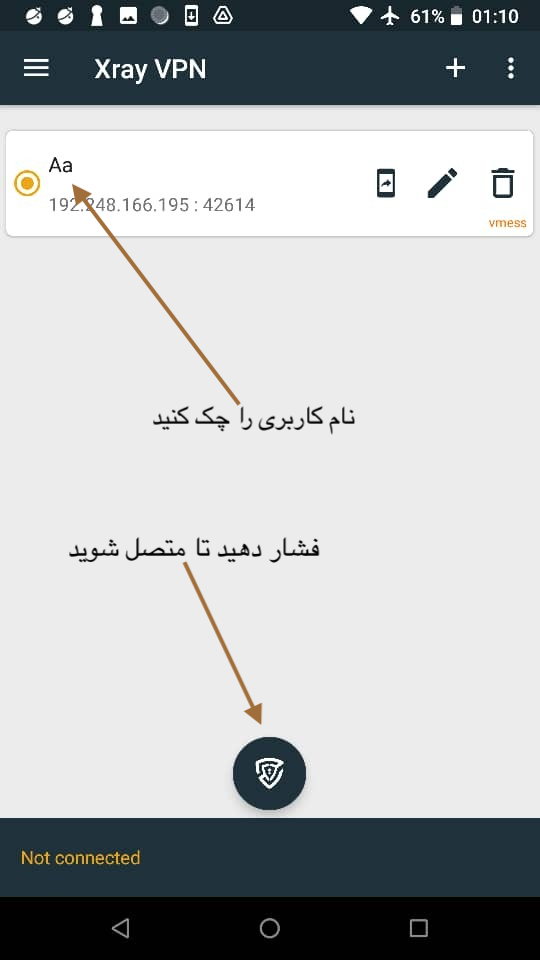{width="2.3296839457567806in"
height="4.141659011373578in"}[]{dir="ltr"}

[]{dir="ltr"}

[در این مرحله اندروید از شما اجازه میگیرن این]{dir="rtl"}
[VPN]{dir="ltr"} [در سیستم نصب شود.]{dir="rtl"}

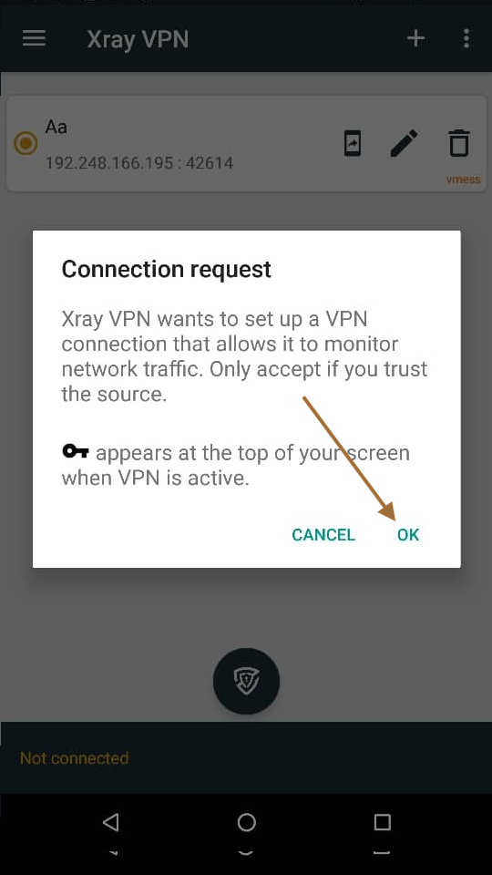{width="2.4488681102362206in"
height="4.356944444444444in"}[]{dir="ltr"}

[]{dir="ltr"}

[]{dir="ltr"}

[]{dir="ltr"}

[]{dir="ltr"}

[در این مرحله اگر همه چیز خوب پیش رفته باشد باید صفحه ای مثل صفحه زیر
ببینید:]{dir="rtl"}

[]{dir="ltr"}

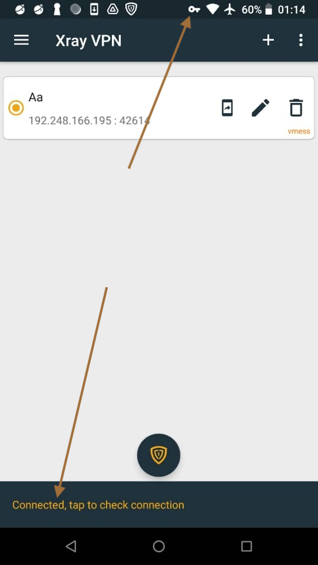{width="2.480725065616798in"
height="4.403583770778653in"}[]{dir="ltr"}

[]{dir="ltr"}

[دقت کنید که در بالای تصویر علامت کلید ظاهر شود. علامت کلید نشان میدهد
که یک]{dir="rtl"} [VPN]{dir="ltr"} [در حال کار در سیستم است.
عبارت]{dir="rtl"} [Connected]{dir="ltr"} [در پایین تصویر نشان میدهد که
اپلیکیشن به سرور وصل شده است. البته هنوز در این مرحله نمی شود مطمئن شد
که گوشی شما به اینترنت آزاد متصل است.]{dir="rtl"}

[]{dir="ltr"}

[لطفا اپلیکیشن های فیلتر شده مثل اینستاگرام و واتساپ را چک کنید. در
صورتی که مشکلی مشاهده کردین به
[[گروه]{.underline}](https://t.me/MahsaAminiVPN)]{dir="rtl"}
[[[تلگرامی]{.underline}]{dir="rtl"}](https://t.me/MahsaAminiVPN)[]{dir="ltr"}
[یا
[[ایمیل]{.underline}](mailto:mahsa.nika.hadis.sarina@gmail.com)]{dir="rtl"}
[[[ما]{.underline}]{dir="rtl"}](mailto:mahsa.nika.hadis.sarina@gmail.com)[]{dir="ltr"}
[پیام بفرستید.]{dir="rtl"}

[]{dir="ltr"}

## [ویندوز (]{dir="rtl"}[Windows)]{dir="ltr"}

[یه ویدیو برامون فرستادن
([[راهنمای]{.underline}](https://t.me/MahsaAminiVPN/347)]{dir="rtl"}
[[[نصب]{.underline}]{dir="rtl"} [[ویندوز]{.underline}]{dir="rtl"}
[[-]{.underline}]{dir="rtl"}
[[ویدیو]{.underline}]{dir="rtl"}](https://t.me/MahsaAminiVPN/347)[]{dir="ltr"}[)
که طریقه فعال سازی رو نشون میده. اگر با ویدیو راحت ترین اون رو تماشا
کنید. همون مراحل رو اینجا به صورت متنی توضیح دادیم.]{dir="rtl"}

[]{dir="ltr"}

[قبل از اینکه ادامه بدید با ادمینهای گروه تلگرامی تماس بگیرین و ازشون
بخواهید که یه کد]{dir="rtl"} [vmess]{dir="ltr"} [براتون ارسال کنند.
البته با]{dir="rtl"} [QR Code]{dir="ltr"} [هم میشه ادامه
داد.]{dir="rtl"}

[]{dir="ltr"}

[]{dir="ltr"}[۱. دانلود]{dir="rtl"} [v2rayN-Core]{dir="ltr"}
[از]{dir="rtl"}
[[[https://github.com/2dust/v2rayN/releases]{.underline}](https://github.com/2dust/v2rayN/releases)
-]{dir="ltr"} [(اینو دانلود کنید اول اونی که حجمش بیشتره بین گزینه‌ها توی
قسمت]{dir="rtl"} [Assets]{dir="ltr"}[)]{dir="rtl"}

[]{dir="ltr"}

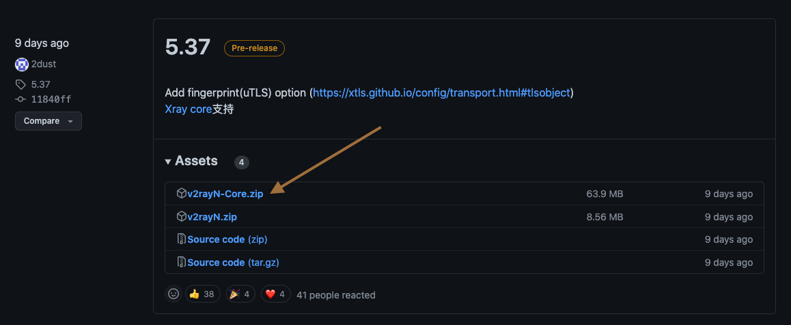{width="7.267716535433071in"
height="3.0in"}[]{dir="ltr"}

[]{dir="ltr"}

[بعد که دانلود کردید، و باز کردید برنامه]{dir="rtl"}
[**v2rayN.exe**]{dir="ltr"} [رو اجرا کنید. بعضی وقتها فقط
توی]{dir="rtl"} [System Tray]{dir="ltr"} [هستش که باید آیکونش رو بزنین
تا پنجره اش نمایش داده بشه:]{dir="rtl"}

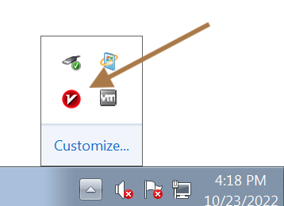{width="2.460425415573053in"
height="1.7855161854768153in"}[]{dir="ltr"}

[]{dir="ltr"}

[]{dir="ltr"}

[]{dir="ltr"}

[]{dir="ltr"}

[]{dir="ltr"}

[]{dir="ltr"}

[]{dir="ltr"}

[]{dir="ltr"}

[]{dir="ltr"}

[]{dir="ltr"}

[]{dir="ltr"}

[]{dir="ltr"}

[بعد مشاهده می کنید که همه چی چینیه. اگر خیلی چینی اتون خوب نیست، بهتره
زبانش رو انگلیسی تبدیل کنید:]{dir="rtl"}

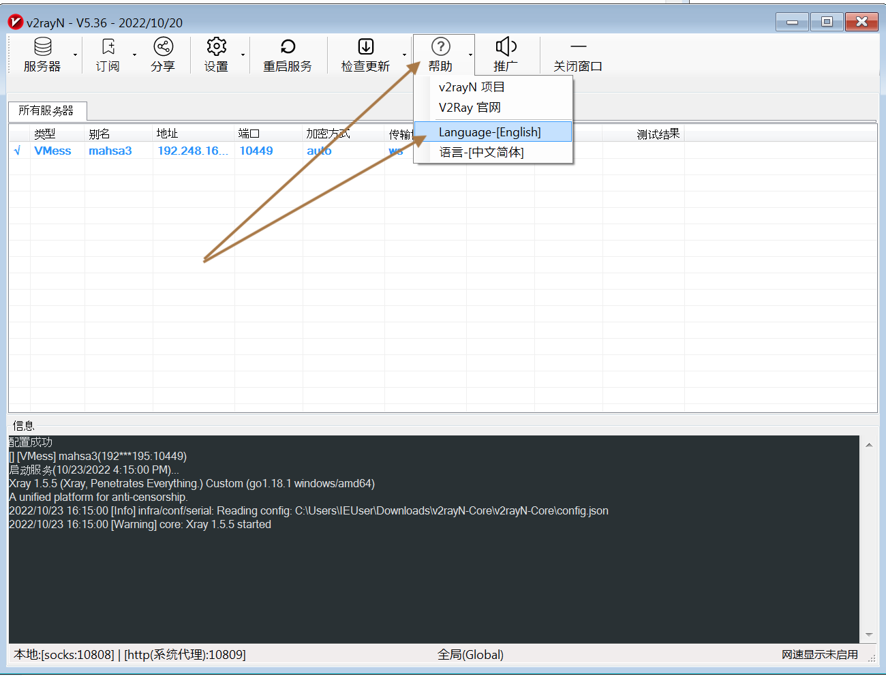{width="6.137508748906387in"
height="4.680787401574803in"}[]{dir="ltr"}

[]{dir="ltr"}

[بعد باید برنامه رو ببندین. هم خود این پنجره اش رو ببندین و هم
از]{dir="rtl"} [System Tray]{dir="ltr"} [خارج بشین:]{dir="rtl"}

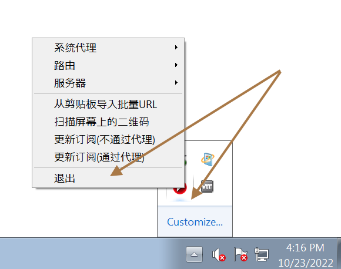{width="4.43959208223972in"
height="3.5057469378827646in"}[]{dir="ltr"}

[]{dir="ltr"}

[دفعه بعد که اجراش می کنید، به خواست ایزد منان، به زبان انگلیسی اجرا
خواهد شد. اگر بخت باهاتون یار بود و چنین شد، گزینه \"]{dir="rtl"}[Import
bulk URL from clipboard]{dir="ltr"}[\" رو از منوی]{dir="rtl"}
[Servers]{dir="ltr"} [انتخاب کنید:]{dir="rtl"}

[]{dir="ltr"}

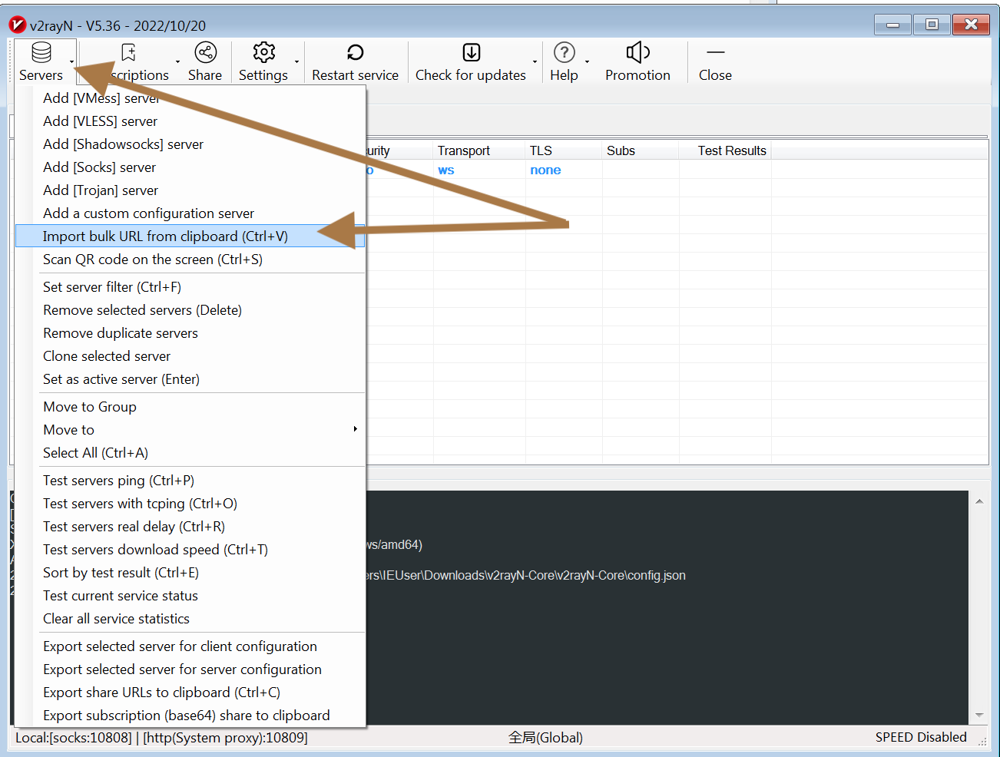{width="7.267716535433071in"
height="5.5in"}[]{dir="ltr"}

[]{dir="ltr"}

[اگر کد]{dir="rtl"} [vmess]{dir="ltr"} [که ادمینها براتون فرستادن
توی]{dir="rtl"} [clipboard]{dir="ltr"} [باشه یا]{dir="rtl"}
[right-click]{dir="ltr"} [و]{dir="rtl"} [copy]{dir="ltr"} [کرده باشید،
سرور باید اضافه بشه به منوهاتون:]{dir="rtl"}

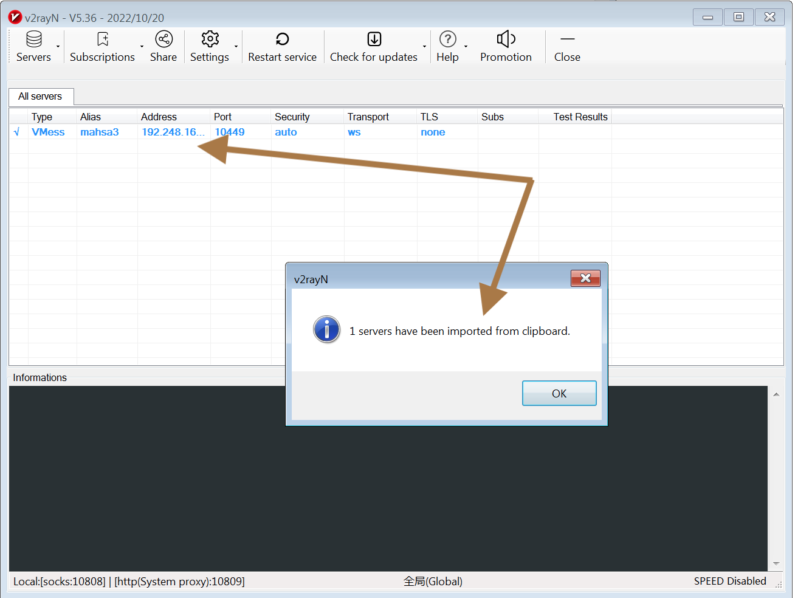{width="5.075008748906387in"
height="3.8171620734908136in"}[]{dir="ltr"}

[بعدش مطمئن بشین که \"]{dir="rtl"}[Set system proxy]{dir="ltr"}[\" از
منوی \"]{dir="rtl"}[System Proxy]{dir="ltr"}[\" انتخاب شده. این منو
یه]{dir="rtl"} [SOCKS]{dir="ltr"} [پراکسی به سیستم شما اضافه می کنه که
توی]{dir="rtl"} [Internet Options]{dir="ltr"} [هم میتونین خودتون اضافه
کنین ولی خوب اینطوری خیلی راحت تره.]{dir="rtl"}

[]{dir="ltr"}

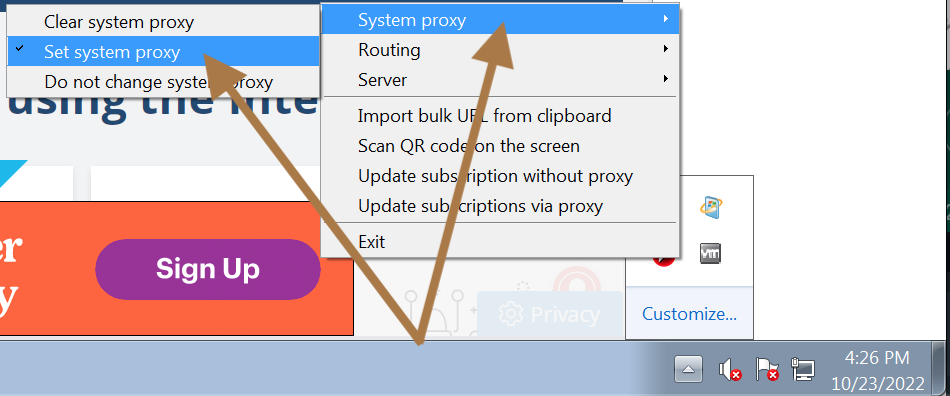{width="6.179175415573053in"
height="2.5795603674540684in"}[]{dir="ltr"}

[]{dir="ltr"}

[بعد از اون باید سیستم]{dir="rtl"} [whitelisting]{dir="ltr"} [این وی پی
ان رو از کار بندازین تا تمام ترافیک رو از وی پی ان رد کنه:]{dir="rtl"}

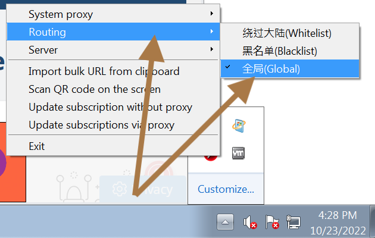{width="4.793758748906387in"
height="3.043655949256343in"}[]{dir="ltr"}

[]{dir="ltr"}

[]{dir="ltr"}

[الان دیگه باید وی پی ان شما، به کوری چشم دشمنانتون، وصل شده باشه. لطفا
چک کنید و اگر اینترنتون کار نمی کنه با گروه تلگرامی تماس
بگیرین.]{dir="rtl"}

[]{dir="ltr"}

[نکته]{dir="rtl"}[]{dir="ltr"}[: بعد از وصل شدن تلگرامم کار می‌کرد فقط
ولی مرورگرها نه! چون افزونه‌های]{dir="rtl"} [vpn]{dir="ltr"} [داشتم روی
کرومم که غیرفعال کردم راه افتاد.]{dir="rtl"}

[]{dir="ltr"}

## [مک -]{dir="rtl"} [Mac OS X]{dir="ltr"}

[[[لینک]{.underline}]{dir="rtl"}](https://www.youtube.com/watch?v=TUvjdk6OTws)[]{dir="ltr"}
[یوتیوب راهنمای نصب برای مک برای یادگیرندگان بصری.]{dir="rtl"}

[]{dir="ltr"}

[تنها تغییر لازم نسبت به این آموزش ورژن هایی هست که توی ویدیو اعلام
میشه. برای هر دو قسمت ورژن آخر رو میتونیم نصب کنیم. برای]{dir="rtl"}
[v2ray-core]{dir="ltr"} [ورژن]{dir="rtl"} [v]{dir="ltr"}[4.31.0 رو
استفاده کردیم. و برای]{dir="rtl"} [qv2ray]{dir="ltr"} [ورژن]{dir="rtl"}
[Qv2ray 2.7.0 - The End]{dir="ltr"}

[]{dir="ltr"}

[آموزش مراحل برای کسانی که نمیتونن لینک یوتیوب رو باز کنن و
ببینن.]{dir="rtl"}[]{dir="ltr"}

[]{dir="ltr"}

[]{dir="ltr"}[- اول قسمت]{dir="rtl"} [System Preferences -\>
Privacy]{dir="ltr"} [رو از مک باز کنید و روی علامت قفل پایینش کلیک کنین
و با اثر انگشت یا رمز فعالش کنین. سپس تب]{dir="rtl"}
[General]{dir="ltr"} [رو باز نگه دارین، در طول استفاده از اپلیکیشن چند
بار لازمش داریم.]{dir="rtl"}[]{dir="ltr"}

[]{dir="ltr"}

[]{dir="ltr"}[- از
ا[[ین]{.underline}](https://github.com/Qv2ray/Qv2ray/releases)]{dir="rtl"}
[[[لینک]{.underline}]{dir="rtl"}](https://github.com/Qv2ray/Qv2ray/releases)[]{dir="ltr"}
[فایل]{dir="rtl"} [Qv2ray-v2.7.0-macOS-x64.dmg]{dir="ltr"} [رو دانلود و
اجرا کنید. اگر ارور داد. توی همون ستینگ پرایوسی که باز نگه داشتین
گزینه]{dir="rtl"} [Allow Anyway]{dir="ltr"} [رو بزنین و دوباره اجراش
کنین.]{dir="rtl"}[]{dir="ltr"}

[]{dir="ltr"}

[]{dir="ltr"}[- از]{dir="rtl"}[]{dir="ltr"}
[[[این]{.underline}]{dir="rtl"}
[[لینک]{.underline}]{dir="rtl"}](https://github.com/v2fly/v2ray-core/releases/tag/v4.31.0)[]{dir="ltr"}
[فایل]{dir="rtl"} [v2ray-macos-64.zip]{dir="ltr"} [رو دانلود کنین
و]{dir="rtl"} [unzip]{dir="ltr"} [کنین.]{dir="rtl"}[]{dir="ltr"}

[]{dir="ltr"}

[]{dir="ltr"}[- اپلیکیشن]{dir="rtl"} [qv2ray]{dir="ltr"} [رو که نصب
کردین از قسمت اپلیکیشن ها اجرا کنین. برای اجرا دابل کلیک نکنین چون ارور
میده. کلیک راست کنین و گزینه اوپن رو انتخاب کنین. دوباره ممکنه مشکل
بخورین و مجبور بشین از قسمت پرایوسی گزینه]{dir="rtl"} [Allow
Anyway]{dir="ltr"}[رو بزنین و دوباره تلاش کنین.]{dir="rtl"}

## []{dir="ltr"}

## []{dir="ltr"}[- داخل اپلیکیشن قسمت]{dir="rtl"} [Preferences -\> Kernel Setting]{dir="ltr"} [رو باز کنین و توی قسمت]{dir="rtl"} [V2Ray CoreExecutable Path]{dir="ltr"} [آدرس فایل]{dir="rtl"} [v2ray]{dir="ltr"} [رو که داخل فولدر آنزیپ شده]{dir="rtl"} [v2ray-macos]{dir="ltr"}[-64 هست بزنین. توی قسمت]{dir="rtl"} [V2Ray Assets Directory]{dir="ltr"} [هم آدرس فولدرش رو بزنین. یعنی ههمون آدرس قبلی رو کپی پیست کنین و فقط قسمت آخرش /]{dir="rtl"}[v2ray]{dir="ltr"}[رو پاک کنین.]{dir="rtl"}

## []{dir="ltr"}

## []{dir="ltr"}[- دکمه]{dir="rtl"} [Check V2Ray Core Settings]{dir="ltr"} [رو بزنین. اگر ارور داد مجدد از قسمت پرایوسی که باز نگه داشتین گزینه]{dir="rtl"} [Allow Anyway]{dir="ltr"} [رو بزنین و دوباره تستش کنین. بعدش]{dir="rtl"}[]{dir="ltr"} [اوکی رو بزنین.]{dir="rtl"}

## []{dir="ltr"}

## []{dir="ltr"}[- گزینه]{dir="rtl"} [Import]{dir="ltr"} [رو بزنین و یکی از لینکها (به جای]{dir="rtl"} [QE]{dir="ltr"} [کد، کد متنی از ادمین ها دریافت کنید) رو توی قسمت]{dir="rtl"} [Share link]{dir="ltr"} [پیست کنین. براش یه اسم بذارین که بدونین کی به کیه. اوکی رو بزنین و همین روند رو برای لینک دیگه انجام بدین.]{dir="rtl"}

## []{dir="ltr"}

## []{dir="ltr"}[- روی سروری که درست کردین دابل کلیک کنین یا انتخابش کنین و علامت]{dir="rtl"} [play]{dir="ltr"} [رو بزنین. باید وصل بشین و بتونین تستش کنین.]{dir="rtl"}

# []{dir="ltr"}

# [راه اندازی سرور (برای سرویس دهنگان)]{dir="rtl"}

[اگر هدف شما استفاده از سرویس وی پی ان هست، به این قسمت احتیاجی ندارید
اما اگر علاقمند هستید سرور جدید اضافه کنید، می توانید قدمهای زیر را
انجام دهید. از شما دعوت می کنیم تا به ادمینهای گروه پیام دهید و آمادگی
سرویس دهی به کاربران دیگر را اعلام کنید. راه اندازی یک سرور جدید فقط ۶
دلار هزینه دارد و شما می توانید ۱۰۰ تا ۲۰۰ کاربر را سرویس دهی
کنید.]{dir="rtl"}

[]{dir="ltr"}

## [دریافت]{dir="rtl"} [VPS]{dir="ltr"}

[برای ایجاد سرور مجازی،‌ ما]{dir="rtl"} [Vultr]{dir="ltr"} [رو پیشنهاد می
کنیم. ولی سرویس دهنده های زیر هم می توانند گزینه های مناسبی باشند
([[اطلاعات]{.underline}](https://privacymelon.com/v2ray-setup-guide/)]{dir="rtl"}
[[[بیشتر]{.underline}]{dir="rtl"}](https://privacymelon.com/v2ray-setup-guide/)[)]{dir="ltr"}

1.  [[Vultr]{.underline}](https://www.vultr.com/) - [سرور از ماهی ۲.۵
    > دلار]{dir="rtl"}

2.  [[DigitalOcean]{.underline}](https://www.digitalocean.com/), [ماهی ۵
    > دلار]{dir="rtl"}

3.  [[RackNerd]{.underline}](https://www.racknerd.com/), [ماهی ۲
    > دلار]{dir="rtl"}

4.  [[Contabo]{.underline}](https://contabo.com/en/)، [ماهی ۴
    > دلار]{dir="rtl"}

5.  [[CloudCone]{.underline}](https://cloudcone.com/), [ماهی ۴
    > دلار]{dir="rtl"}

[در ادامه این مستند ما فرض میکنیم که شما از]{dir="rtl"}
[Vultr]{dir="ltr"} [استفاده می کنید. در صورت استفاده از سرویس های دیگر و
موفقیت آمیز بودن نصب به
[[گروه]{.underline}](https://t.me/MahsaAminiVPN)]{dir="rtl"}
[[[تلگرامی]{.underline}]{dir="rtl"}
[[ما]{.underline}]{dir="rtl"}](https://t.me/MahsaAminiVPN)[]{dir="ltr"}
[پیام دهید تا به این مستند اضافه شود.]{dir="rtl"}

[]{dir="ltr"}

[]{dir="ltr"}[۱. ایجاد اکانت - یک حساب کاربری ایجاد کنید]{dir="rtl"}

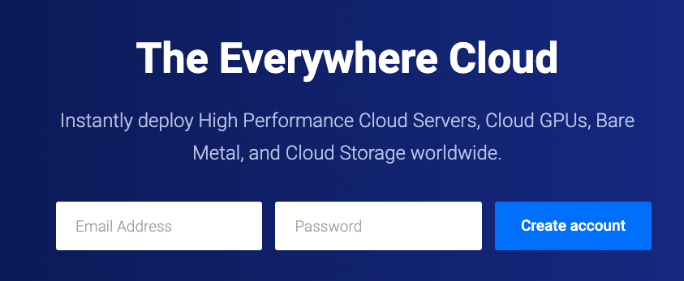{width="4.609375546806649in"
height="1.8969346019247595in"}[]{dir="ltr"}

[]{dir="ltr"}[۲. پرداخت پول - متاسفانه این سایت کارتهای من رو قبول نمی
کرد و من با پیپال پرداخت را انجام دادم. پرداخت با پیپال به نظرم بهتر هم
هست چون پرداخت های بعدی در کنترل شماست.]{dir="rtl"}

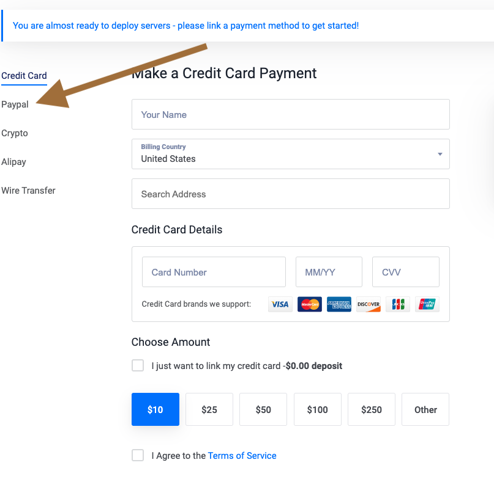{width="3.49247375328084in"
height="3.406505905511811in"}[]{dir="ltr"}

[]{dir="ltr"}[۳. ایجاد سرور جدید. برای سرور جدید ما گزینه های زیر را
پیشنهاد می کنیم]{dir="rtl"}

-   Server: Cloud Compute

-   CPU: Intel - High Performance

-   Location: Europe - London

-   Server Image: Ubuntu - 22.10 LTS x64

-   Server Size: \$6/month - 1 vCPU - 1 GB - 2 TB Bandwidth

[اگر می خواهید از سرور های ارزانتر ۲.۵ دلاری استفاده کنید
باید]{dir="rtl"} [Location]{dir="ltr"} [را به]{dir="rtl"} [America -
Miami]{dir="ltr"} [تغییر دهید. این]{dir="rtl"} [Vultr]{dir="ltr"}
[موجودی های متغیری دارد، در هنگام نگارش این مستند این مناطق موجودی دارند
ولی در زمانی که شما امتحان می کنید ممکن است موجودی ها عوض شود. سرعت
دسترسی در]{dir="rtl"} [London]{dir="ltr"} [از بقیه مناطق در هنگام نگارش
این مقاله بیشتر بود.]{dir="rtl"}

[]{dir="ltr"}

[نکته]{dir="rtl"}[]{dir="ltr"}[: برای پرداخت هزینه کمتر،
گزینه]{dir="rtl"} [Enable Auto Backups]{dir="ltr"} [رو خاموش کردم
:-)]{dir="rtl"}

[]{dir="ltr"}

[وقتی سرور را دریافت کردید مطمئن شوید که می توانید]{dir="rtl"}
[SSH]{dir="ltr"} [کنید و به سرور دسترسی دارید.]{dir="rtl"}

[]{dir="ltr"}

[]{dir="ltr"}

## [نصب نرم افزار]{dir="rtl"} [X-UI]{dir="ltr"} [و]{dir="rtl"} [V2RAY]{dir="ltr"}

[برای نصب لطفا از اسکریپت]{dir="rtl"}
[[[v2ray_setup.sh]{.underline}](https://github.com/ypo777/x-ui-panel/blob/main/Bash/v2ray_setup.sh)]{dir="ltr"}
[استفاده کنید. نکته مهم اینکه دو دستور زیر حجم بسیار زیادی از دیسک را
اشغال می کنند. نصب]{dir="rtl"} [SSL]{dir="ltr"} [هم به این راحتی که این
اسکریپت گفته نیست. برای همین اسکریپت را خلاصه کرده ام. در صورت تمایل از
ورژن ما استفاده کنید:]{dir="rtl"}

[]{dir="ltr"}

#!/bin/bash

#Progress Bar

echo \"Installing Requirements\"

#Requirement Installation

sudo apt install software-properties-common -y

sudo apt install curl -y

sudo apt-get install certbot -y

echo \"Start Install v2ray\"

#Install v2ray UI script

bash \<(curl -Ls
https://raw.githubusercontent.com/vaxilu/x-ui/master/install.sh)

[]{dir="ltr"}

[در صورت استفاده از نسخه اصلی اسکریپت پس از پایان نصب با اجرای
دستور]{dir="rtl"} [sudo apt clean]{dir="ltr"} [حجم زیادی از فایلهای موقت
غیر ضروری پاک خواهد شد و فضای خالی بیشتری روی دیسک خواهید
داشت]{dir="rtl"}[]{dir="ltr"}

[]{dir="ltr"}

[]{dir="ltr"}

[در پروسه نصب چند سوال از شما پرسیده میشود. در صورتی که زبان چینی را به
درستی بلد نیستید از این راهنما استفاده کنید :-)]{dir="rtl"}

[]{dir="ltr"}

[سوال اول از شما میپرسد که تضمین کنید بعد از نصب، کلمه رمز و شماره پورت
را عوض می کنید. این اطلاعات در ترمینال ذخیره شده اند و دیگر امن
نیستند:]{dir="rtl"}

[]{dir="ltr"}

出于安全考虑，安装/更新完成后需要强制修改端口与账户密码

确认是否继续?\[y/n\]:y

[]{dir="ltr"}

[]{dir="ltr"}

[سوال دوم از شما میپرسد که کلمه کاربری تعیین کنید. این کلمه کاربری بعدا
برای دسترسی به کنترل پنل استفاده خواهد شد. ما کلمه کاربری]{dir="rtl"}
[mahsa_amini]{dir="ltr"} [را پیشنهاد می دهیم چون صدها میلیون بار تویت
شده و راحت یادتان میماند :-)]{dir="rtl"}

请设置您的账户名:mahsa_amini

[]{dir="ltr"}

[سوال سوم از شما کلمه رمز را میپرسد. این کلمه رمز بعدا برای دسترسی به
کنترل پنل استفاده خواهد شد. لطفا کلمه رمز دیگری از آنچه اینجا پیشنهاد
شده انتخاب کنید:]{dir="rtl"}[]{dir="ltr"}

您的账户名将设定为:mahsa_amini

请设置您的账户密码:mahsaAmini123

[]{dir="ltr"}

[سوال چهارم از شما شماره پورت را میپرسد. این پورت هم بعدا برای دسترسی به
کنترل پنل استفاده خواهد شد.]{dir="rtl"} []{dir="ltr"}

您的账户密码将设定为:mahsaAmini123

请设置面板访问端口:8080

[]{dir="ltr"}

[بعد از اینکه نصب به درستی انجام شد، سرور را اجرا کنید]{dir="rtl"}

root@vultr:\~# x-ui start

[]{dir="ltr"}

[خدا خیرتان بدهد. شما قدم مهمی برای ایجاد دسترسی به اطلاعات آزاد به
دوستان، آشنایان و دیگران فراهم کردید. \"یک قدم کوچک برای انسان، یک قدم
بزرگ برای بشریت\".]{dir="rtl"} []{dir="ltr"}

## [تنظیمات سرور]{dir="rtl"}

[ما به خطرات بسیار زیاد امنیت و سکیوریتی آگاه هستیم و مطمئن هستم که شما
از اجرا نکردن دستور]{dir="rtl"} [apt-get update]{dir="ltr"} [از ما
ناراحت هستید. با این وجود از شما دعوت می کنیم که خیلی به فکر امنیت سرور
نباشید. سعی کنید هیچ چیزی غیر از این نرم افزار]{dir="rtl"}
[x-ui]{dir="ltr"} [روی سرور نصب نکنید. هیچ اطلاعات شخصی از شما نباید روی
سرور باشد. پیشنهاد می کنم هیچ اسم و آدرسی از شما روی سرور
نباشد.]{dir="rtl"}

[]{dir="ltr"}

[در قدم اول در تنظیمات سرور مطمئن باشید که فایروال ولتر برای شما خاموش
است:]{dir="rtl"}

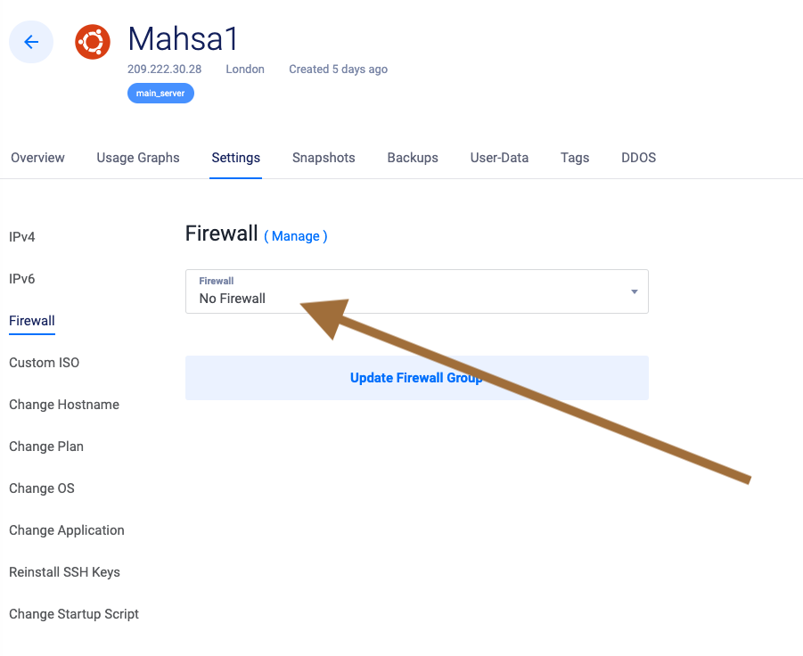{width="4.623172572178477in"
height="3.776042213473316in"}[]{dir="ltr"}

[]{dir="ltr"}

[در قدم دوم فایروالی که روی سرورتان اجرا هست را خاموش کنید]{dir="rtl"}

[]{dir="ltr"}

root@vultr:\~# sudo ufw disable

[]{dir="ltr"}

[در صورتی که از خاموش کردن فایروال از ما دلخور هستید، لطفا مطمئن شوید که
پورت 8080 و 22 برای سرور شما باز است تا پنل مدیریتی و]{dir="rtl"}
[SSH]{dir="ltr"} [کار کنند. انگیزه شما رو برای امنیت تحسین می کنیم ولی
چون برای هر کاربر پورت متفاوتی لازم هست، ما دنبال این دردسر
نبودیم.]{dir="rtl"}

[]{dir="ltr"}

[نکته: از علاقمندان دعوت می شود بعد از نصب فایروال را فعال کنند و
راهنمایی کنند تا بتوانیم با وجود فایروال به کاربران سرویس دهیم
(]{dir="rtl"}[TODO)]{dir="ltr"}

[]{dir="ltr"}

[]{dir="ltr"}

## [پنل کاربری]{dir="rtl"}

[بعد از نصب و تنظیمات نوبت به استفاده از پنل کاربری هست. پنل به زبان
چینی است. می توانید با استفاده از گوگل ترنسلیت پنل رو ترجمه کنید یا اگر
مثل ما به زبان با تمدن چینی علاقه مند هستید از این پنل به زبان چینی
استفاده کنید. ما قضاوت نمی کنیم 😄]{dir="rtl"}

[]{dir="ltr"}

[صفحه اول، صفحه ورود به پنل است. مطمئنم که از پسش بر خواهید اومد
💪🏼]{dir="rtl"}

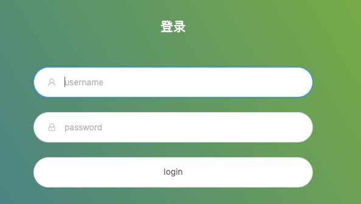{width="3.6614588801399823in"
height="2.068445975503062in"}[]{dir="ltr"}

[]{dir="ltr"}

[بعد از وارد شدن صفحه اصلی پنل نمایش داده می شود]{dir="rtl"}

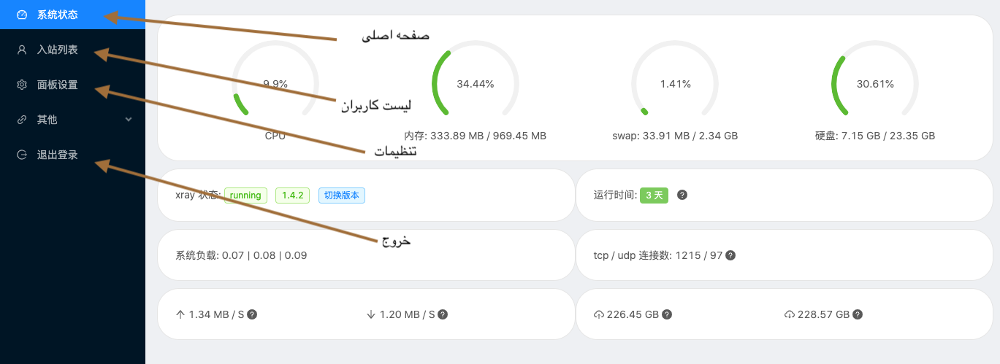{width="7.4354090113735785in"
height="2.7111417322834646in"}[]{dir="ltr"}

[]{dir="ltr"}

[لطفا به صفحه]{dir="rtl"}[]{dir="ltr"} [لیست
کاربران]{dir="rtl"}[]{dir="ltr"} [بروید و کلید + را فشار
دهید]{dir="rtl"}

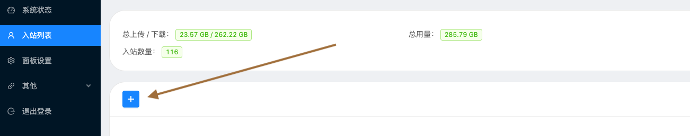{width="7.37709208223972in"
height="1.461211723534558in"}[]{dir="ltr"}

[در صفحه ای که باز می شود اطلاعات زیر را وارد کنید:]{dir="rtl"}

[]{dir="ltr"}[۱. نام کاربری]{dir="rtl"}

[]{dir="ltr"}[۲. محدودیت پهنای باند]{dir="rtl"}

[]{dir="ltr"}[۳. پروتکل]{dir="rtl"} [ws]{dir="ltr"}

{width="3.463542213473316in"
height="3.96501968503937in"}[]{dir="ltr"}

[شاید تنظیمات دیگر هم با فیلترینگ ایران کار کند، متاسفانه ما هنوز تست
نکردیم. اگر تست کردین و موفقیت آمیز بود و سرعت بهتری دریافت کردید لطفا
از طریق [[گروه]{.underline}](https://t.me/MahsaAminiVPN)]{dir="rtl"}
[[[تلگرامی]{.underline}]{dir="rtl"}](https://t.me/MahsaAminiVPN)[]{dir="ltr"}
[به ما اطلاع دهید تا این مستند رو بروز کنیم.]{dir="rtl"}

[]{dir="ltr"}

[بعد از اضافه کردن کاربر، می توانید]{dir="rtl"} [QR code]{dir="ltr"} [را
برای هر کاربر دریافت کنید. روی دکمه ای که مشخص شده است کلیک
کنید:]{dir="rtl"}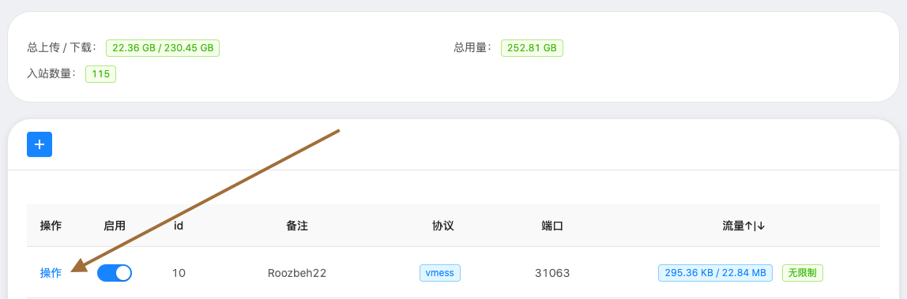{width="7.3729090113735785in"
height="2.434636920384952in"}[]{dir="ltr"}

[سپس روی اولین گزینه کلیک کنید:]{dir="rtl"}

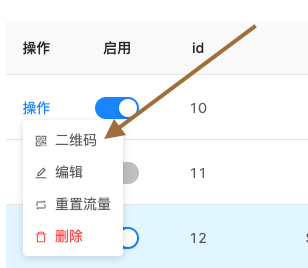{width="3.2083333333333335in"
height="2.7916666666666665in"}[]{dir="ltr"}

[]{dir="ltr"}

[اگر دکمه]{dir="rtl"} [COPY]{dir="ltr"} [را بزنید،]{dir="rtl"}
[ServerLink]{dir="ltr"} [یا آدرس]{dir="rtl"} [vmess]{dir="ltr"} [هم به
کلیپ بورد کپی خواهد شد. به تجربه ما، بیشتر کاربران ترجیح
میدهند]{dir="rtl"} [QR Code]{dir="ltr"} [را داشته باشند چون کار کردن
باهاش راحت تر است.]{dir="rtl"}

[]{dir="ltr"}

## [نصب]{dir="rtl"} [SSL]{dir="ltr"}

[سرور]{dir="rtl"} [X-UI]{dir="ltr"} [کاملا مطابق با]{dir="rtl"}
[HTTP]{dir="ltr"} [یا]{dir="rtl"} [SSL]{dir="ltr"} [هست. برای راه
اندازی]{dir="rtl"} [SSL]{dir="ltr"}[، شما قبل از هر چیز به دامنه احتیاج
دارید. می توانید از دامنه های مجانی هم استفاده کنید. برای دومین مجانی
ما]{dir="rtl"}
[[[freedns.afraid.org]{.underline}](http://freedns.afraid.org/)]{dir="ltr"}
[استفاده کردیم ولی اصلا توصیه نمی کنم. فیلترینگ در حال حاضر در ایران
پیچیده است و دامین های خاصی هم فیلتر می شوند. برای همین استفاده از دومین
به جای]{dir="rtl"} [IP]{dir="ltr"} [یک مرحله کار شما را پیچیده تر می
کند.]{dir="rtl"}

[]{dir="ltr"}

[به هر ترتیب برای ادامه این مستند ما فرض می کنیم شما دومین]{dir="rtl"}
[mahsa.amini.com]{dir="ltr"} [را به آی پی]{dir="rtl"} [VPS]{dir="ltr"}
[که دریافت کرده اید متصل کرده اید.]{dir="rtl"}

[]{dir="ltr"}

### [دریافت]{dir="rtl"} [certificate]{dir="ltr"}

[ابتدا نرم افزار]{dir="rtl"} [certbot]{dir="ltr"} [را نصب کنید. این نرم
افزار به شما اجازه میدهد تا به صورت رایگان گواهینامه]{dir="rtl"}
[SSL]{dir="ltr"} [دریافت کنید:]{dir="rtl"}

root@vultr:\~# sudo apt-get install certbot -y

[]{dir="ltr"}

[سپس با استفاده از اطلاعات خودتان (ایمیل و آدرس دامنه) درخواست سرتیفیکیت
کنید:]{dir="rtl"}[]{dir="ltr"}

[]{dir="ltr"}

root@vultr:\~# sudo certbot certonly \--standalone
\--preferred-challenges http \--agree-tos \--email mahsa@amini.com -d
mahsa.amini.com

[]{dir="ltr"}

[در صورت موفقیت آمیز بودن، سرتیفیکیت های شما در آدرسهای زیر ذخیره
میشود:]{dir="rtl"}

[]{dir="ltr"}

IMPORTANT NOTES:

\- Congratulations! Your certificate and chain have been saved at:

/etc/letsencrypt/live/mahsa.amini.com/fullchain.pem

Your key file has been saved at:

/etc/letsencrypt/live/mahsa.amini.com/privkey.pem

[نکته: دقت کنید اگر]{dir="rtl"} [DNS]{dir="ltr"} [رکورد درستی از دامنه
به]{dir="rtl"} [IP]{dir="ltr"} [وجود نداشته باشد این دستور اجرا نخواهد
شد.]{dir="rtl"}

[]{dir="ltr"}

[در مثال بالا کلید های عمومی و خصوصی در آدرسهای زیر قرار گرفته
اند:]{dir="rtl"}

-   /etc/letsencrypt/live/nima2.mooo.com/fullchain.pem ([کلید های
    > عمومی]{dir="rtl"})

-   /etc/letsencrypt/live/mahsa.amini.com/privkey.pem ([کلید
    > خصوصی]{dir="rtl"})

[]{dir="ltr"}

[حالا باید آدرسهای بالا را در تنظیمات پنل بروزرسانی کنید:]{dir="rtl"}

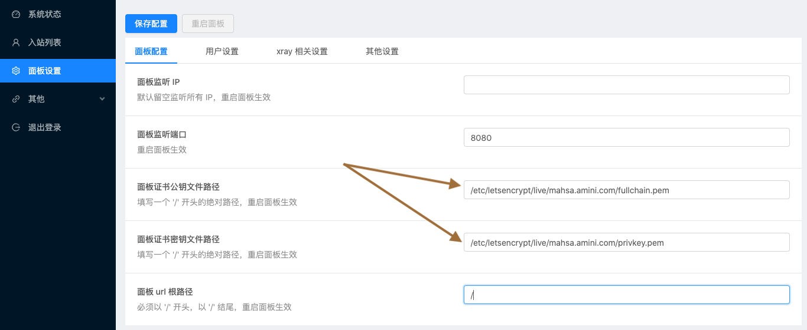{width="7.3312423447069115in"
height="3.0004308836395452in"}[]{dir="ltr"}

[]{dir="ltr"}

[سرور را ریستارت کنید:]{dir="rtl"}

root@vultr:\~# x-ui stop

root@vultr:\~# x-ui start

[]{dir="ltr"}

[حالا باید بتوانید با آدرس]{dir="rtl"}
[[[https://mahsa.amini.com:8080]{.underline}](https://mahsa.amini.com:8080)]{dir="ltr"}
[به سرورتان متصل شوید.]{dir="rtl"}[]{dir="ltr"}

[]{dir="ltr"}

[]{dir="ltr"}

[]{dir="ltr"}

[]{dir="ltr"}

# [مراجع]{dir="rtl"}

[[https://privacymelon.com/v2ray-setup-guide/]{.underline}](https://privacymelon.com/v2ray-setup-guide/)
(v2ray installation guide)

[[https://github.com/ypo777/x-ui-panel/blob/main/README.md]{.underline}](https://github.com/ypo777/x-ui-panel/blob/main/README.md)
(X-UI installation guide)

[[https://github.com/ypo777/x-ui-panel/blob/main/Bash/v2ray_setup.sh]{.underline}](https://github.com/ypo777/x-ui-panel/blob/main/Bash/v2ray_setup.sh)
(X-UI + V2Ray installation script)

[]{dir="ltr"}
